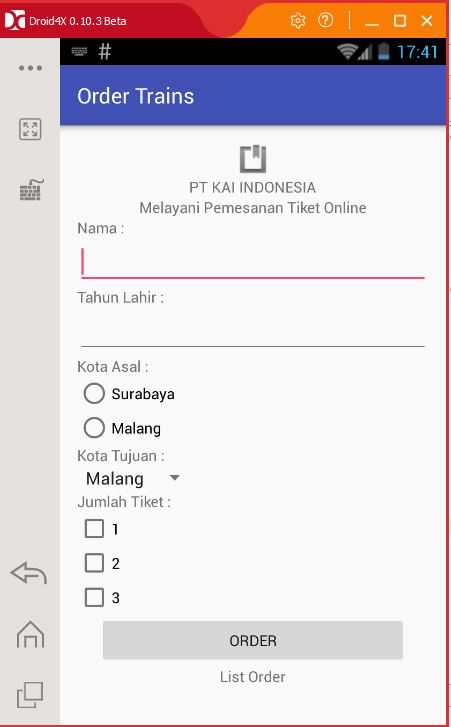
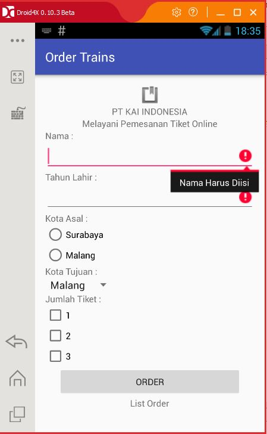
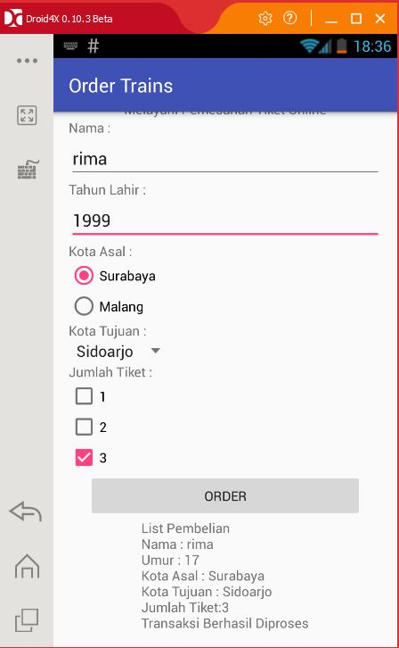

# TUGAS001 ORDER TRAINS
<h2><b> Identitas : </b></h2>

<h3><b>Nama : Rima Anggraini</b></h3>

<h3><b>Kelas : XIIR4</b></h3>

<h3><b>No. Urut : 30</b></h3>

<h3><b>NIS : 4423/1321.063</b></h3>

<h3><b>Nama Sekolah : SMK TELKOM MALANG</b></h3>

<h2><b> Definisi Program : </b></h2>

<h3><b>program ini digunakan untuk pemesanan tiket kereta api secara online dengan keberangkatan kota asal surabaya atau malang setelah memesan melalui ini pengguna aplikasi tinggal menunjukan rincihan pemesanan pada petugas kereta api  </b></h3>

